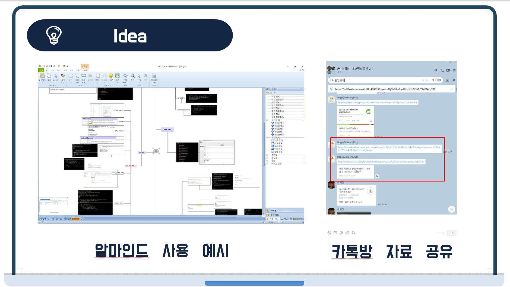
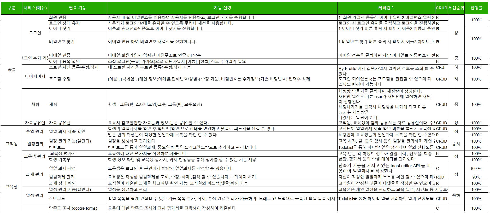
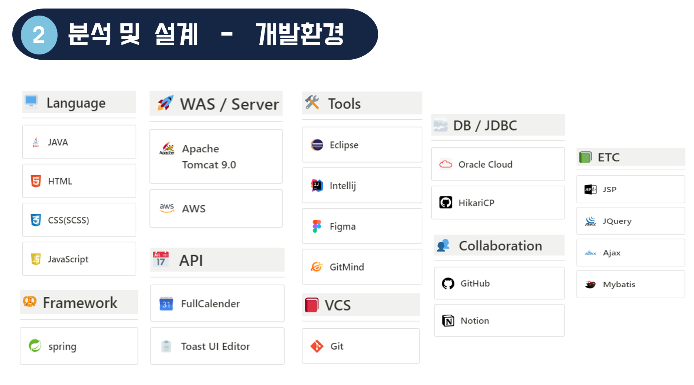
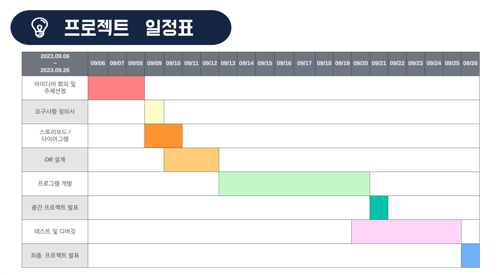

# DailyRecord
팀 오순도순의 대보2기 파이널 프로젝트 Repository

## 1. 분석 및 설계

### 아이디어

``` text
교육중 불편했던 일일과제 제출 프로그램과 자료 공유 프로그램들을
통합한 프로그램 구현
```
### 요구사항 정의서


### 개발환경


### 일정


### 링크
[팀 노션 바로가기](https://www.notion.so/Final-Project-d3e1a0dc349f4d4ab002651357b624b1)
<br>
[깃 허브 바로가기](https://github.com/Daebo2th/final-pj)